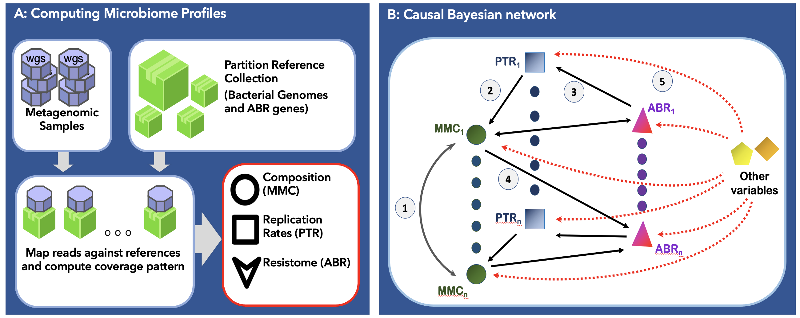

# RAPToR

<b>R</b>esistome <b>A</b>bundance and <b>P</b>eak-to-<b>T</b>r<b>o</b>ugh <b>R</b>atio (<b>RAPToR</b>)
is a novel scalable pipeline with a two-step process of establishing a causal connection between microbiome variables.
The first step involves computing antibiotic resistance (ABR) profiles, microbial metagenomics composition (MMC),
and replication rates (PTR). In the second step, a causal structure learning algorithm was applied to discern relationships
between the computed MMC, PTR, ABR, and the clinical variables.

The pipeline consist of three modules: 

* [A-microbiome_profiles](https://github.com/stebliankin/RAPToR/tree/master/A-microbiome_profiles) - Compute resistome, compositional, and replicome profiles from metagenomic samples; 
* [B-Causality](https://github.com/stebliankin/RAPToR/tree/master/B-Causality) Apply causal inference to PTR, microbial profile, resistome profile, and clinical variables  

Each of the models has detailed instructions on how to run the parts of the pipeline.

## Requirments
* [Slurm](https://slurm.schedmd.com/documentation.html)
* [Python](https://www.python.org/)
* [BioPython](https://biopython.org/)
* [Pandas](https://pandas.pydata.org/)
* [Bowtie2](http://bowtie-bio.sourceforge.net/bowtie2/index.shtml)
* [iRep](https://github.com/christophertbrown/iRep)

## Publication

More information about the method can be found in the following paper:

"A novel approach for combining metagenome, resistome, replicome, and causal inference to determine microbial survival strategies against antibiotics" - Vitalii Stebliankin, Musfiqur Sazal, Camilo Valdes, Kalai Mathee, and GiriNarasimhan (Under Review, 2021)
